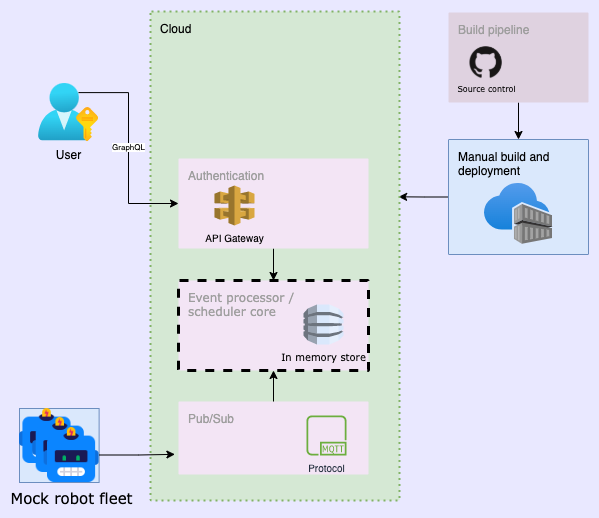
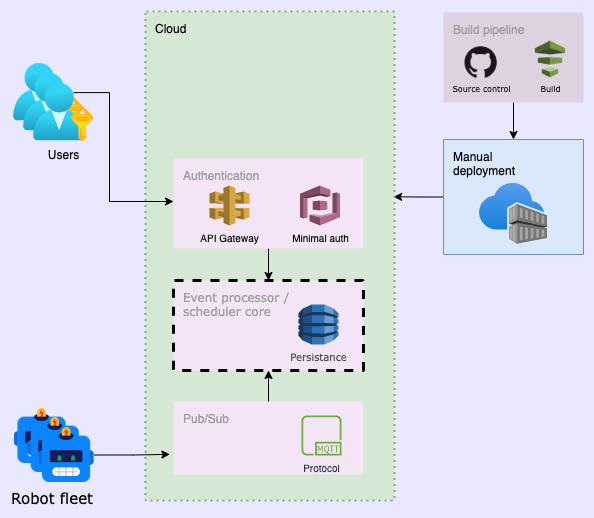
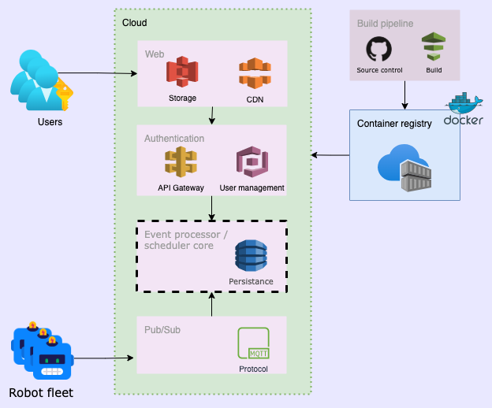
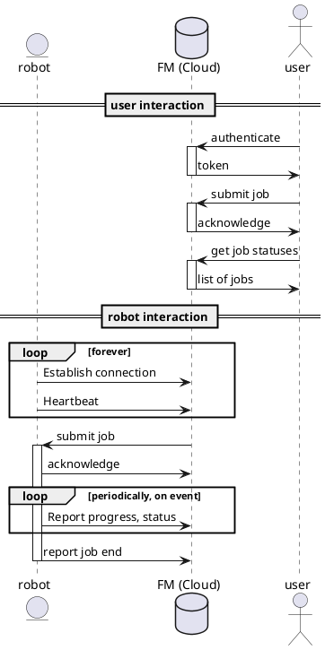

# Architecture

## Challenge
### Timeframe
* In 3 weeks from now, we need to deliver a proof of concept to showcase the potential of the solution.
* In 3 months from now, we need to deliver a prototype version to be installed on the field in selected robots.
  * The prototype should have a minimal set of functionalities in place to be validated and improved until the final solution is given.
* In 6 months from now, we need to deliver the complete solution.

### Business rules
* The fleet management (FM) system runs in the cloud.
* The robots interact with the FM system to receive requests and update the status of ongoing tasks.
* The users interact with the FM system to send requests without knowing which robot will perform the request.

## Approch
* Begin with the end in mind
* Review assumptions each step of the way
* Go forward, build on previous work
## Beginning with the end in mind

Lets imagine a system that has grown well beyond our initial expectations.
Load is high, there are many users, with complex individual access requirements, outages from a single cloud provider are unaccpetable, and API access is required for programatic control.
With this in mind we can work backwards and decide what is suitable for our current set of requirements

 

## Interaction of major components
* Robots maintain a connection to the FM
* Robots periodically report status, task progress etc
* Users submit jobs
* Users see status, progress of those jobs

 

## Feature matrix
| Feature              | Proof | Proto | Prod |
|-------------------   |:-----:|:-----:|:----:|
|**Robot features**    |
| Submit jobs          |  ✅   |  ✅   |   ✅ |
| List jobs            |  ✅   |  ✅   |   ✅ |
| Manage existing jobs |       |       |   ✅ |
|**User features**     |
| Web interface        |       |  ✅   |   ✅ |
| Security groups      |       |       |   ✅ |
|**Future features**   |
| State replication    |       |       |   ✅ |
| Other clients        |       |       |   ✅ |

 
 

## Proof of concept
With the proof of concept we want to validate the current ideas we have about managing a list of tasks completed over time by a robotic fleet
* Use of a local server may be considered if its expected to provide faster development time
  * But also need to take into account time needed to migrate to cloud in subsequent steps
* No authentication, or minimal in case of cloud.  That is any user has full access to submit and list jobs
* Use MQTT between robots and server
* user job interface - graphql, rest
* Mock robot behaviour
* Code is built and deployed manually
* No permanant persistence system, memory only

  
 
 

## Prototype
With the prototype we want to validate that our proof of concept system can operate as expected in the environment and at the scale we are desiging for
* Real robot clients, no more mocking
* Core system in cloud, persists state
* Multiple users, but single level of authentication
* Introduce build system, but deploy is manual

 
 

## Production
In the production phase we want to deliver a commercial system meeting current demands while providing a path forward for likely next phases
* Web interface for users
* Admin area for robot fleet management
* Security groups, users have access to subset of robots as permitted
* Devops pipeline - automated build, testing, packaging, deployment
* Multiple client type support - web, phone, tablet

## Future considerations
* High availability
  * Regional failover, state replication
  * Multi cloud redundancy
  * Consider event log replication
  * Consider failure modes in such cases, avoidance or mitigation of duplicate task dispatching
* Video streaming
* programatic API access
* Telemetry, Log aggregation

## Appendix

#### Sequence diagram source

